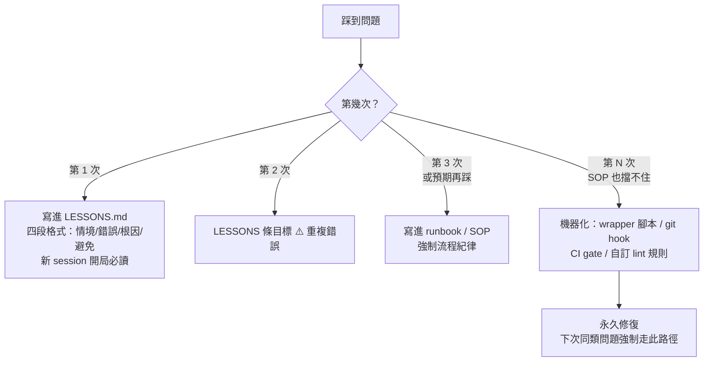
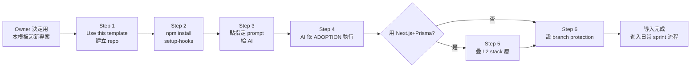
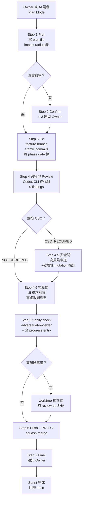
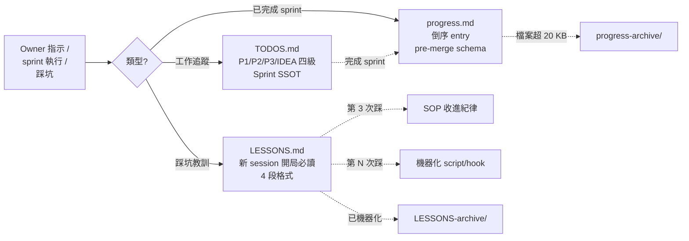

# Harness 模板深度總覽

> **這份文件的定位**：概念層 + 完整流程 + 13 gates 對照 + 5 張流程圖 —— 給想懂全貌的讀者（Owner、評估採用者、新加入的開發者）。
>
> **不是**：導入教學（那是 [`docs/QUICKSTART.md`](QUICKSTART.md)）；也不是行為規則正本（那是 [`../CLAUDE.md`](../CLAUDE.md) 與 [`../.claude/sop/plan-mode-checklist.md`](../.claude/sop/plan-mode-checklist.md)）。
>
> **SSOT 錨定（重要）**：本文件是概念與流程的**摘要與說明**、不是 authoritative 規則。若本文件與 `CLAUDE.md` 或 `.claude/sop/plan-mode-checklist.md` 有出入，**一律以那兩份為準**。本文件會定期同步、但可能落後最新 sprint（若發現漂移歡迎開 issue / PR）。

**目標讀者**：Owner（產品擁有者、無需工程背景）；也給未來要導入本模板的開發者。

---

## 目錄

1. [這是什麼、為何需要](#一這是什麼為何需要)
2. [核心公式與哲學](#二核心公式與哲學)
3. [兩個方向 × 四組關卡](#三兩個方向--四組關卡)
4. [三層拆法（L1 / L2 / L3）](#四三層拆法l1--l2--l3)
5. [教訓 → 機器化的升級階梯](#五教訓--機器化的升級階梯)
6. [導入者流程（第一次接觸模板）](#六導入者流程第一次接觸模板)
7. [Sprint 流程：Plan Mode 7 步 SOP](#七sprint-流程plan-mode-7-步-sop)
8. [13 道 gates 詳解](#八13-道-gates-詳解)
9. [記憶層三檔治理](#九記憶層三檔治理)
10. [Effort 策略](#十effort-策略)
11. [Degradation：外部工具降級路徑](#十一degradation外部工具降級路徑)
12. [實例：教訓走完 4 階的三個案例](#十二實例教訓走完-4-階的三個案例)
13. [附錄：目錄樹 + 命令對照](#十三附錄目錄樹--命令對照)

---

## 一、這是什麼、為何需要

### 一句話定義

**一套讓非工程背景的產品擁有者（Owner）也能與 AI coding agent（Claude Code、Codex 等）長期協作、開發正式產品的「可控安全環境」**。以 GitHub template 形式提供、開箱即用。

### 為何需要

單靠 AI 模型的智力寫 code 是不夠的。真實產品面對：
- **金流** — 一個 bug 一場官司
- **會員個資** — 一個外洩一次危機
- **多租戶隔離** — 一個 tenant scope 遺漏一次資料混淆
- **長期維運** — 8 個月 80+ sprint 的累積偏差

沒有經驗豐富的工程 team 檢查，Owner 只能依賴「AI 自己說 OK」。這條路的失敗率高、且失敗成本會超過重寫。**本模板的答案**：把每一次踩坑蒸餾成永久修復、進到環境裡、讓下個 AI session 遇到同類問題**強制走同樣機器化路徑**、不能靠 AI 記憶或 Owner 提醒。

### 實績來源

本模板的每一道關卡都不是設計出來的、是**從一條真實產線上蒸餾出來的**：
- **8 個月、80+ 個 sprint、320+ 個 pull request、2,300+ 個自動化測試**
- 涵蓋金流、會員個資、多租戶隔離
- 由**一位無技術團隊的產品擁有者**與 AI 協作完成

抽取成模板後，模板自己也走過完整 SOP：
- 批 1-10 backfill sprint 走過 7 步 SOP 全流程
- TODOS P3 backlog 現況清 0
- 453 個測試、gitleaks 全史 no leaks、npm audit 0 vulnerabilities

---

## 二、核心公式與哲學

### 核心公式

> **Agent = Model + Harness**（Anthropic 2026、Fowler / Böckeler 2026-04）

- **Model**（Claude、GPT、Gemini …）：決定**智力上限**
- **Harness**（模型以外的一切環境工程）：決定**錯誤率下限**

模型智力再高、若 harness 弱，同樣的錯會被反覆犯。強 harness 讓中等智力模型也能穩定產出正式品質。

### 哲學

> **每當 AI 犯錯，就在環境裡工程化一個永久修復。**
> — Mitchell Hashimoto, 2026-02

這句話是整套模板的**唯一設計原則**。所有其他規則、SOP、gates 都是這句話的執行方式。

### 兩個推論

1. **靠 AI 記憶或 Owner 提醒 = 失敗**。因為記憶會漂、Owner 會忘。要成永久修復，就要落到環境裡（code / script / hook / CI）。
2. **模板永遠不會「完工」**。每次踩到新坑就是下一道關卡的圖紙。

---

## 三、兩個方向 × 四組關卡

Harness 元件分兩個方向（Fowler / Böckeler 2026-04 框架）：

- **前饋 Guides**（Feed-forward）：在 AI 行動**之前**引導它、提高第一次就做對的機率
- **回饋 Sensors**（Feedback）：在 AI 行動**之後**偵測錯誤、讓它自我修正

本模板內建 **13 道 gates**、分四組（依觸發時機由早到晚）。⚠️ 這 13 道**不全是 hard gate**——CI 硬擋、可 `--no-verify` 的本機 hook、人守的 SOP、advisory、週期治理混在同一張表；每道的強度分級 / trigger / bypass / 證據 / 測試狀態以 [CONTROL-CATALOG.md](CONTROL-CATALOG.md)〈依強度分級〉為正本（由 `scripts/control-catalog.json` 渲染、`npm run check:catalog` 驗一致與 CI 雙向對應）。本節與 README 的 13 道是概念層敘述，不重列 gate 契約。


每組的守備範圍：

| 組 | 觸發時機 | 誰負責 | 核心目的 |
|---|---|---|---|
| 一、前饋守則層 | AI 起手 | AI（讀規則） | 減少「不知道要照什麼規則做」的隨機性 |
| 二、本機回饋層 | 寫 code 到 commit | 本機工具 | 錯誤不離開機器 |
| 三、審查層 | commit 到 push | 跨模型 review + Owner | PR 開出來前就乾淨、CI 只是最後驗收 |
| 四、遠端與長期層 | push 之後 | CI + 定期人工 | 防長期漂移、抓漏網之魚 |

**設計原則：Keep quality left**：檢查越早跑修得越便宜。本機 hook → 每 phase 閘門 → push 前審查 → CI → 絕不留到 production。

---

## 四、三層拆法（L1 / L2 / L3）

| 層 | 內容 | 位置 | 你需要動嗎 |
|---|---|---|---|
| **L1 通用核心** | 守則、SOP、effort 策略、subagent 定義、記憶模板、自檢腳本、git hooks、CI 安全掃描 | repo top-level | 幾乎不改（可 fork 客製） |
| **L2 stack 層** | Next.js + Prisma 專用：4 支自訂 ESLint AST 規則、migration 守衛、CI 片段 | `stack/nextjs-prisma/` opt-in | 用該堆疊才疊上；不同堆疊就參考 pattern 自寫 |
| **L3 專案層** | 你的業務知識、敏感路徑表實值、實際累積的教訓 | 不在模板內 | **必填**、每個專案自己長 |

### L1 通用核心的目錄結構

```
.claude/
├── agents/          # Claude Code subagent 定義（adversarial-reviewer、explore-scoped）
├── memory/          # 記憶層三檔 + archive
├── sop/             # Plan Mode 7 步 checklist、decision-request 模板
└── settings.json    # effort level 等 session-wide 設定

scripts/
├── check-*.ts       # 7 支自檢器（bookkeeping / claims / cso / doc-refs / doc-size / no-source-terms / todos）
├── check-hooks.sh   # 驗 git hooks 本身活著
├── cso-trigger.config.ts   # 敏感路徑表（出廠為空、L3 填）
├── deny-terms.txt   # 去識別化 denylist
├── git-hooks/       # pre-commit / commit-msg / pre-push
├── lib/             # destructive-guard.ts + marker-self-pr.ts
├── mutate.ts        # 破壞性 mutation 探針
├── setup-hooks.sh   # 一鍵啟用 git hooks
└── weekly-health-check.ts

tests/               # 11 支 vitest 測試對應每支 check-*
.github/workflows/ci.yml   # 全 gate 匯集點
CLAUDE.md            # 三層行為守則
README.md            # 專案首頁
TODOS.md             # 工作追蹤（SSOT）
```

### L2 stack 層（僅提供 Next.js + Prisma 一種堆疊）

`stack/nextjs-prisma/` 底下：
- **4 支自訂 ESLint AST 規則**：tenant-scope（多租戶隔離）、raw client（禁用 raw Prisma client）、blanket disable（禁大範圍 lint disable）、unclosed test pool（防 test 資源洩漏）
- **`__tests__/`**：每支 rule 用 RuleTester 契約測試
- **`scripts/`**：`check-prisma-schema-refs.ts`、`safe-migrate.ts`、`ci-migrate.sh`（安全 migration 流程）
- **`ci-snippets/prisma-ci-steps.yml`**：CI 片段（貼進主 workflow 用、非獨立 workflow）

**不同堆疊怎麼辦**：無 opinion。你自己按 L2 pattern 寫（AST rule 契約測試 + CI 片段 + safe-migration 守衛）。

### L3 專案層（模板不提供、每個專案自己填）

- `CLAUDE.md` Part 4 六節留白骨架（技術堆疊 / Design System / Health Stack / 部署 / 禁區 / Git 規範）
- `scripts/cso-trigger.config.ts` 五域路徑表（**出廠為空** = fail-closed、必須填才能生效）
- `.claude/memory/LESSONS.md` 你自己的教訓

---

## 五、教訓 → 機器化的升級階梯

**這是本 harness 的靈魂**。單一 gate 不稀奇，稀奇的是**它們怎麼長出來的**。每條教訓走同一條 4 階階梯：



### 為什麼要 4 階漸進、不一次到頂

**成本考量**：
- 第 1 階（寫 LESSONS）：5 分鐘
- 第 4 階（機器化）：可能要 1-3 天（設計 + 寫 script + 寫測試 + 加 CI + 除錯）

若每個問題一次到頂：
- 花費爆炸、學習速率過低
- 大量「其實不會再踩」的問題被過度工程化

**紀律**：升到下一階要有證據（實際又踩了）、不是預期。

### 實測結果

**13 道 gates 中至少 7 道是這條階梯的產物**。範例（詳見第十二節）：
- 去識別化 denylist context-aware 升級（第 4 次同類踩坑後機器化）
- SOP 「先 dogfood 自己 repo」規則（9 輪 review 都沒抓到、自我執行才浮現）
- 量詞自檢器 `check:claims`（審查長尾一直卡在同一句過度宣稱、第 3 次機器化）

### Meta 教訓

**Cross-model agreement ≠ correctness**（8 個月雙模型審查驗證）：兩個模型找到的問題**幾乎不重疊**。這是為什麼 SOP 要跑兩道獨立 review、且「某模型說沒問題」永遠不被當成證據。

---

## 六、導入者流程（第一次接觸模板）

**目標**：用本模板從零建立一個新專案、約 30-40 分鐘。

### 流程總覽



### 導入者「做什麼」vs「AI 做什麼」

| 誰 | 動作 |
|---|---|
| **Owner（人）** | Step 1-3：GitHub 上按 `Use this template`、`gh repo create --template`、`npm install && npm run setup-hooks`、貼一段給 AI 的 prompt |
| **AI** | Step 4：依 `docs/ADOPTION.md` 10 節逐項執行（填 CLAUDE.md Part 4、設 CSO 路徑表、設 branch protection 清單、設 destructive guard 常數 …） |

### 導入 checklist 十節（AI 執行、Owner 監督）

依 `docs/ADOPTION.md`：

1. **基本識別** — LICENSE / README / package.json / CLAUDE.md 內的 Owner 名稱
2. **CLAUDE.md Part 4 填空** — 技術堆疊 / Design System / Health Stack / 部署 / 禁區 / Git 規範
3. **思考力道與 agent** — `.claude/settings.json` 內 effortLevel、agent 定義
4. **安全敏感域路徑表** — `scripts/cso-trigger.config.ts` 五域（認證 / 金流 / 個資 / 權限 / 資產轉移）+ 前台入口 + 沒有的域在 `CSO_NOT_APPLICABLE` 宣告理由（完整性鎖測試 always-on、依 `scripts/harness.config.json` 宣告的 mode 分支）
5. **本機 git hooks** — `npm run setup-hooks` + 保護分支清單 + `PROTECTED_DOCS` SSOT + default-deny NON_CODE_PATTERN + `TOOL_ARTIFACT_PATTERN`(本機工具產物,任何分支擋;同清單進 `.gitignore`)
6. **Destructive guard** — 改 FLAG_ENV / CONFIRM_TOKEN 常數
7. **CI** — 分支清單、Source-term scan 保留或移除、`.gitleaks.toml`
8. **記憶層啟用** — progress / LESSONS / TODOS 三檔第一次寫入
9. **週健檢** — 首次 `npm run health:weekly` 產出 W## baseline
10. **外部工具全 optional** — Codex CLI、gstack、gbrain 有就用、沒有就走 degradation

### 不用做的事（模板已就位）

- **gstack / Codex / gbrain 全域裝好**：模板不管、Owner 環境層自訂
- **記憶層模板已就位**：progress.md / LESSONS.md / TODOS.md 檔頭有 schema，直接寫
- **effort 只設一個專案預設**：不要每 sprint 手動調

---

## 七、Sprint 流程：Plan Mode 7 步 SOP

**每個非瑣碎 sprint 一律走這 7 步。** 不是每 sprint 靠 Owner 重複交代、進 Plan Mode 那一刻自動觸發。

### 流程總覽



### 各步詳解

#### Step 1 — Plan（Effort：high）

**做什麼**：寫一份 plan file 到 `~/.claude/plans/*.md`。含：
- Context（起手 git 核實）
- Phases 拆解
- 關鍵檔案 + 驗證方式
- 風險 + 不在範圍
- D-numbered Sensible Defaults（可讓 Owner 逐條否決）
- **Impact radius 小表**（關鍵新增）：分「打算改的檔」vs「會被影響的檔」
- 起手記憶對抗檢查（過去教訓有沒有相關？）

可派 `.claude/agents/explore-scoped.md` 做 read-only 探查（最多 3 個、通常 1 個）。

**STOP point**：impact-radius 先寫完才能離 Step 1；真實取捨才問 Owner。

#### Step 2 — Confirm（Effort：low）

**做什麼**：取捨釐清（≤3 題），否則直接 ExitPlanMode。

**判準**：MVP vs full / 商業規則 / 法務風險 → 真取捨、問。命名 / 檔名格式 / 門檻數字 / 目錄結構 → sensible default 自己拍板 + `[Owner 可否決]` 標記。

#### Step 3 — Go（Effort：xhigh）

**做什麼**：
- 開 feature branch（`feature/<sprint-name>`）
- Atomic commits per phase
- 每 phase 完跑 `npm run typecheck && npm run lint && npm run test` 全綠 gate

**不 push、不 PR**（review 只讀本地 diff、PR 開出來就是乾淨版）。

真實取捨用 `.claude/sop/decision-request-template.md` 通知 Owner。

**STOP point**：紅就修到綠。

#### Step 4 — 跨模型 Review（Effort：medium、最後一輪 high）

**做什麼**：
1. **先固定 baseline SHA**（工作樹髒 = 假 baseline，不能開跑）
2. 預設 Codex CLI `/codex review`；exit 124 fallback 三段：retry → `/codex challenge` → Herdr（人工介入）
3. Findings 三軸標記：
   - P1（critical）/ P2（advisory）
   - 來源三選一：既有缺陷 / 漏改 consumer / baseline 後引入
   - **行為級 / 散文級**二分（散文級照抄替換句、不燒確認輪）

**壓輪數三條紀律**（極重要、SOP〈壓輪數的三條紀律〉詳述）：
1. **行為 vs 散文二分校準表**（8 條實例 + fail-open 紀律）
2. **「自檢一遍」加硬成三句**：
   - 新機制 → 跑 mutation 探針
   - 改時序 → 問「哪條測試的 tick 推不到？」
   - 新宣稱句 → 跑量詞自檢器
3. **不變量要連守法一起審**、不只審那句敘述

**STOP point**：0 actionable findings 才進 Step 5。

**收乾判準**：5 輪後主動評估收乾；findings 挑理論邊界（該做更多型）→ defer TODOS P3 而非本 sprint 修。

#### Step 4.5 — CSO 安全關（Effort：xhigh、條件觸發）

**做什麼**：
1. 跑 `npx tsx scripts/check-cso-trigger.ts`
2. 對**完整變更面**（committed + staged + unstaged + untracked 四源聯集）比對敏感路徑表
3. **Fail-closed**：空路徑表 = 判定壞掉；模板 repo 為設計例外

**`CSO_REQUIRED` → 進高風險車道**、加兩件事：
- **破壞性 mutation 探針**：`scripts/mutate.ts`，exit 0 硬 gate、綁最後非 bookkeeping SHA
- **Step 5 多加 worktree 獨立審**

**`CSO_NOT_REQUIRED` 也要人工自問一次**（機器判定是下限、不是上限）。

#### Step 4.6 — 視覺關（Effort：medium、條件觸發）

**做什麼**：diff 碰 UI 才觸發。**實際把畫面跑起來截圖**、對照 design tokens。**讀程式碼推論外觀不算數**。

預設 gstack `/design-review`；降級手動截圖（Tailwind v4 `@theme` 拼錯會靜默無樣式警告）。

**降級後等於沒做** — DEGRADATION 全表唯一「degradation = 沒做」的關卡。

#### Step 5 — Sanity Check + Progress Entry（Effort：medium）

**做什麼**：
1. 第二道 review（對本地 diff）—— 用 `.claude/agents/adversarial-reviewer.md` subagent
2. Findings 分類 severity × confidence 雙軸
3. **高風險車道 worktree 獨立審**：`isolation: worktree`、綁 review-tip SHA（完整 40 字元）、fix 後 HEAD 前進要重派 agent + 新 worktree
4. **Bookkeeping commit 機器化核對**：`npm run check:bookkeeping`、allowlist 只放 progress.md / TODOS / BACKLOG / progress-archive
5. **寫 progress entry**（pre-merge schema）進 feature branch 最後一個 commit，含：
   - 緣起 / 改動 / 審查 / 驗證 / 教訓 / 下一棒候選 / check:claims 處置
   - **Cost field**（rounds / P1 / P2 / Step5 獨立發現）
   - **量測三項**（model+effort / baseline SHA / 來源分佈）
   - TODOS ✅ 條目留 `PR #___` placeholder

**STOP point**：critical 全修 + progress entry 已 commit + TODOS ✅ 有 placeholder。

#### Step 6 — Push + PR + CI（Effort：low）

**做什麼**：
1. Push 前跑一次完整本地 gate（⚠️ commit **之後**跑、不是之前）
2. `git push -u origin feature/<sprint-name>`
3. `gh pr create` → 拿到 PR 號
4. **只掃本 branch 新引入的 placeholder**、填 PR 號（例：`(#33)`）
5. CI 綠 → `gh pr merge --squash --delete-branch`

高風險車道非 bookkeeping 修復 commit → 回 4.5 / 5 重跑。

#### Step 7 — Final（Effort：low）

**做什麼**：
- Progress entry 和 TODOS 都已在 Step 5/6 寫完、**此步不重複**
- 若有新踩坑 → 寫進 LESSONS.md
- Progress 過長 → 歸檔到 `progress-archive/`
- 通知 Owner

### 節奏分層

SOP 對節奏也有分層規劃（`plan-mode-checklist.md` 〈節奏分層 — per-change / 里程碑 / 階段〉）：
- **A. 里程碑 / EPIC**：三層安全審分工
- **B. 階段占位**：驗證 / 部署階段
- **C. 除錯入口**
- **刻意不加的項目**：反 ceremony（別堆疊沒必要的儀式）

### 例外：不走完整流程的情境

`docs-only` 判準（`plan-mode-checklist.md` 〈適用範圍 — 完整 SOP vs docs-only〉 三條）+ 完整 SOP 硬條件清單（〈適用範圍 — 完整 SOP vs docs-only〉）決定該不該走完整 7 步。以下可跳（但**觸 🔴 條件即失格**：spec / 安全 / 治理 / 守門 / CI）：
- typo 修正
- 顯而易見的單行修改
- 純粹格式整理
- Owner 明說「快速做就好」

---

## 八、13 道 gates 詳解

### 對照表：gate × 實作 × CI 位置

| # | Gate | 實作檔案 | CI 位置 |
|---|---|---|---|
| ① | 三層行為守則 | `CLAUDE.md` Part 1-3 | — |
| ② | Plan Mode 7 步 SOP + effort | `.claude/sop/plan-mode-checklist.md` + `docs/EFFORT.md` + `.claude/settings.json` | — |
| ③ | 記憶層治理 | `.claude/memory/{progress,LESSONS}.md` + root `TODOS.md` | `check-todos-markers` step |
| ④ | 每 phase 品質閘門 | `npm run typecheck / lint / test`；L2 加 `stack/nextjs-prisma/eslint-rules/*` | ci.yml typecheck/lint/vitest |
| ⑤ | Git hooks 縱深 | `setup-hooks.sh` + `git-hooks/{pre-commit, commit-msg, pre-push}` + `code-pattern.sh` | `check-hooks.sh` 驗 hook 本身 |
| ⑥ | Destructive 四層守衛 | `scripts/lib/destructive-guard.ts`（FLAG_ENV + CONFIRM_TOKEN + dry-run + summary） | `tests/destructive-guard.test.ts` |
| ⑦ | 量詞自檢器 | `scripts/check-claims.ts` + `npm run check:claims` | 刻意非 CI gate（待處置產生器） |
| ⑧ | CSO 觸發 | `scripts/check-cso-trigger.ts` + `cso-trigger.config.ts` + `mutate.ts` + `mutations/` | 人工在 Step 4.5 執行 |
| ⑨ | 視覺關 | gstack `/design-review`（外部） | — |
| ⑩ | 第二道 review + worktree | `.claude/agents/adversarial-reviewer.md` + `scripts/check-bookkeeping-commit.ts` | — |
| ⑪ | CI 常駐 | `.github/workflows/ci.yml` 全檔 | 每個 step 逐條登錄於 [CONTROL-CATALOG.md](CONTROL-CATALOG.md)〈hard-automated〉（數量不在此寫死） |
| ⑫ | 週健檢 | `scripts/weekly-health-check.ts` + `npm run health:weekly` → `.claude/memory/health-history/` | — |
| ⑬ | 季 retro | `.claude/memory/LESSONS-archive/` + `progress-archive/` | — |

### 一、前饋守則層（Gates ①②③）

#### ① 三層行為守則（`CLAUDE.md`）

三部分：
- **Part 1 通用工作原則**（Karpathy-inspired）：Think Before Coding、Simplicity First、Surgical Changes、Goal-Driven Execution、Checkpoint、Sensible Default with Veto …
- **Part 2 協作偏好**：輸出格式、任務啟動流程、主動性、錯誤教訓記錄、Plan Mode 流程規則
- **Part 3 何時可以放寬規則**：typo / 顯而易見的一行 / 純格式整理

**D-numbering 機制**：非關鍵決策 AI 拍 sensible default、寫進 plan file 標 `[Owner 可否決]`；提問額度留給真取捨。

#### ② Plan Mode 7 步 SOP + Effort 建議

- 完整 SOP：`.claude/sop/plan-mode-checklist.md`
- Effort 策略：`docs/EFFORT.md`
- Session-wide 設定：`.claude/settings.json`

每步都有：activity / STOP point / effort 建議。詳見第七節。

#### ③ 記憶層治理

三檔：
- `.claude/memory/progress.md` — 開發進度倒序
- `.claude/memory/LESSONS.md` — 教訓庫（新 session 開局必讀）
- `TODOS.md`（repo root）— 工作追蹤 SSOT

治理紀律詳見第九節。

### 二、本機回饋層（Gates ④⑤⑥）

#### ④ 每 phase 品質閘門

L1 通用：`npm run typecheck && npm run lint && npm run test` — 每 phase 完跑一次全綠 gate。

L2 加持（Next.js + Prisma）：4 支自訂 AST rule：
- **tenant-scope**：多租戶隔離守衛
- **raw client**：禁用 raw Prisma client
- **blanket disable**：禁大範圍 lint disable
- **unclosed test pool**：防 test 資源洩漏

#### ⑤ Git hooks 縱深（三層）

由 `scripts/setup-hooks.sh` 設 `core.hooksPath = scripts/git-hooks/`：

| Hook | 職責 |
|---|---|
| **pre-commit** | 保護分支守衛（main/master 上不能直接 commit code、doc 放行） |
| **commit-msg** | 訊息去識別化檢查（`deny-terms.txt` 不在時自動 no-op） |
| **pre-push** | 本機 gitleaks（有 leak 硬擋）+ 保護分支 code push 確認 |

驗 hook 本身活著：`scripts/check-hooks.sh`。

#### ⑥ Destructive 四層守衛

`scripts/lib/destructive-guard.ts`：任何危險腳本（如 `mutate.ts`）都用這個 lib 包一層：

1. **環境旗標**（如 `HARNESS_MUTATE_ENABLE=1`）
2. **確認 token**（隨機字串、必須參數傳入）
3. **Dry-run 預設**（`--commit` 才真跑）
4. **執行摘要**（動了什麼、影響哪些檔）

契約由 `tests/destructive-guard.test.ts` 守。

### 三、審查層（Gates ⑦⑧⑨⑩）

#### ⑦ 跨模型對抗審查 + 量詞自檢器

**跨模型審查**：
- 迭代到 0 findings
- 三條**壓輪數紀律**（見第七節 Step 4）
- 5 輪後主動評估收乾；理論邊界 finding → defer TODOS P3

**量詞自檢器 `scripts/check-claims.ts`**：
- 在你自己的 diff 新增行裡揪出過度宣稱（「只有 / 唯一 / 各自都足夠 / 全面」等量詞）
- **刻意不是會擋的 CI gate**、是**待處置清單產生器**
- 為什麼不擋：量詞在說明文字有大量合法用途、命中 ≠ 錯誤、命中 = 「這句話宣稱的集合，你得列得出來」
- 若寫成 denylist-by-value 硬擋，只會生出「以值為準的白名單」— 這正是本模板一再警告的反模式

#### ⑧ 條件式安全審查（CSO）

**觸發判定機器化**：`scripts/check-cso-trigger.ts` 對完整變更面比對 `scripts/cso-trigger.config.ts` 敏感路徑表（五域：認證 / 金流 / 個資 / 權限 / 資產轉移）。

**高風險車道 = 判 `CSO_REQUIRED` 時 sprint 額外加**：
- 破壞性 mutation 探針（`scripts/mutate.ts` + `mutations/` 目錄的探針集）
- Step 5 worktree 獨立審

**機器判定是下限、不是上限**：即使判 `NOT_REQUIRED`、Owner 認為敏感也可手動觸發。

#### ⑨ 條件式視覺審查

- diff 碰 UI 才觸發
- **實跑截圖對照 design tokens**、讀程式碼推論外觀不算數
- 預設 gstack `/design-review`；降級手動截圖
- **降級後等於沒做**（DEGRADATION 全表唯一如此的關卡）

#### ⑩ 第二道 review（sanity check）+ worktree 隔離

- 第一道（Step 4）: Codex CLI 對抗審
- **第二道（Step 5）**: 對本地 diff 用 adversarial-reviewer subagent 做 fresh 審
- **軸不同**：Codex 抓 pure fn / 邏輯層；adversarial-reviewer 抓守門缺口 / 決策 audit / 漏改 consumer
- **cross-model agreement ≈ 0 是常態**、兩層都不能省

**高風險車道加 worktree 獨立審**：
- `isolation: worktree` 讓 subagent 在全新 checkout 跑
- 綁 review-tip SHA（完整 40 字元）
- Fix 後 HEAD 前進要重派 agent + 新 worktree
- 目的：抓「依賴本地未提交狀態」型的錯

**Bookkeeping commit 機器化核對**：`scripts/check-bookkeeping-commit.ts` — allowlist 精確清單（TODOS.md / BACKLOG / progress.md / progress-archive/*）。若 bookkeeping commit 含其他檔 → 判非純 bookkeeping、Step 4.5 / 5 / 6 條件重跑。

### 四、遠端與長期層（Gates ⑪⑫⑬）

#### ⑪ CI 常駐閘門

`.github/workflows/ci.yml` — 單 job `ci`、timeout 10 min、`permissions: contents: read`（最小權限）。

**Workflow-level env SSOT**（批 10 收乾）：
- 交付證據唯一來源 = 受驗的 `origin/HEAD`(目標須宣告在 `harness.config.json` `deliveryBranches`;`DELIVERY_REFS` env 已移除、不再讀)
- `MARKER_SELF_PR = ${{ github.event.pull_request.number }}`

CI step 逐條登錄於 [CONTROL-CATALOG.md](CONTROL-CATALOG.md)〈hard-automated〉（正本 `scripts/control-catalog.json`，
`npm run check:catalog` 驗每個 step 與 catalog 雙向一一對應）；本節不重列 step 清單與數量，避免漂移。供應鏈守衛：
`actions/checkout` / `actions/setup-node` SHA-pinned、gitleaks pinned binary + sha256 校驗。

#### ⑫ 週健檢

`scripts/weekly-health-check.ts` + `npm run health:weekly` → 產出 `.claude/memory/health-history/YYYY-W##.{md,json}`。

**三個 collector**（已實作）：
1. **TODOS.md P1 open / completed 趨勢**（工作累積）
2. **LESSONS.md 近 7 天新增條目數**（教訓產出速率；暴增 = bug 多 / 知識曲線陡）
3. **Progress cost field 加總**（**審查鈍化偵測** — 交付量沒少但 findings 持續掉 → 通常是 review 變走過場、不是 code 變好）

**兩個規格化但刻意未實作**：
- 教訓機器化率
- 記憶歸檔解析漂移

原因：兩者都需先在 `LESSONS.md` 與 archive stub 建立 marker 慣例、在那之前硬做會生「看起來像量測、其實不是」的數字。README 誠實揭露（原則 7「失敗要大聲說」自我適用）。

#### ⑬ 季 retro

- 封存已機器化教訓：`.claude/memory/LESSONS-archive/`
- 記憶防膨脹：`progress-archive/`（`check-doc-size.ts` 監控 20/60 KB 額度）
- 掃文件交叉引用防漂移：`check-doc-refs.ts`

---

## 九、記憶層三檔治理

### 檔案角色



### `.claude/memory/progress.md` — 開發進度

**Schema**：pre-merge（批 8 定型）— 排除 PR 號 / squash SHA / CI 狀態（post-merge 才知）。

**Entry 範本**（`progress.md` 檔頭 〈Entry 格式範本〉）：
- 緣起 / 改動 / 審查 / 驗證 / 教訓 / 下一棒候選 / check:claims 處置
- Cost field：rounds / P1 / P2 / Step5 獨立發現
- 量測三項：model + effort / baseline SHA / 來源分佈

**Partial entry**：sprint 中斷 → 走 checkpoint flow、標「⚠️ partial」；恢復時**就地擴寫、不 append 第二份**（避免 squash 進 delivery 帶 stale partial）。

### `.claude/memory/LESSONS.md` — 教訓庫

**Schema**（〈教訓格式範本〉）：情境 / 錯誤 / 根因 / 避免 / 相關檔案。

**教訓升級階梯 4 階**（見第五節）。

**新 session 開局必讀**（AI 每次啟動先讀）。

**「流程/工具」段**收「已 port 的跨專案教訓」（如批 5 「call site 必須另守」被 port 進 SOP〈壓輪數的三條紀律〉⑶）。

### `TODOS.md` — 工作追蹤 SSOT

**分級**：
- 🔴 P1（上線前必做）
- 🟡 P2（1-3 個月內處理）
- 🟢 P3（長期）
- ⚪ IDEA（未採用備案）

**Marker 治理公約**（重要）：
- 完成宣稱 `✅` 必須引用 `(#N)` 或 `PR #N`
- CI `scripts/check-todos-markers.ts` 驗有 merge 證據
- 阻塞詞列表（⏳ / 卡 / 待外部 / 待拍板）— **子字串比對**、不要用否定句
- 阻塞解除時**直接刪詞**、不寫「不再待拍板」

**SSOT 位置**：完成狀態的 SSOT 是本檔、**記憶層勿抄為權威**。

### 為何三檔一起 pre-merge

批 5 教訓（進 SOP〈壓輪數的三條紀律〉⑶）：
> BACKLOG / TODOS 標「刀 X ✅」的 bookkeeping 必須併進該刀 feature branch、跟 progress entry 走同一輪 CI

否則會踩「每 sprint 收尾多 1 支 PR + 1 輪 CI 純浪費」的坑。

---

## 十、Effort 策略

### 核心原則

**Effort 是成本桿、不是品質旋鈕**（`docs/EFFORT.md` 〈為什麼要分層〉）。

- Opus 5 支持「較低 effort 的 fast pass」— 但**只支持模型單 pass 準確度**
- **不等於**「輪數由 effort 決定」（不同 finding 需要的 fix round 由 finding 性質決定、不由 effort）

### 各 SOP 步驟 effort 建議

| Step | Effort | 理由 |
|---|---|---|
| 1 Plan | 🎚️ high | 探索、判斷、拆刀，需要 deep thinking |
| 2 Confirm | 🎚️ low | 只有澄清、無 heavy lifting |
| 3 Go | 🎚️ xhigh | 寫 code 品質最高 |
| 4 Review | 🎚️ medium（最後一輪 high） | 迭代到 0 findings，最後一輪拉高防漏 |
| 4.5 CSO | 🎚️ xhigh | 高風險，最高 caution |
| 4.6 視覺 | 🎚️ medium | 對照 tokens、標準流程 |
| 5 Sanity | 🎚️ medium | Fresh 審、不重、獨立視角 |
| 6 Push+PR | 🎚️ low | 機械動作 |
| 7 Final | 🎚️ low | Housekeeping |

### 兩個常見誤解

1. **Effort 不控制回覆長度** — 要精簡要在提示詞明講、不是降 effort
2. **不要為省錢關 thinking** — 關掉 thinking 讓工具呼叫洩漏成純文字、污染 context

### Sweep（比對數據）三項人工填

Progress entry 內的量測段（`docs/EFFORT.md` 〈要做 sweep，先量對東西〉）：
1. **Model + Effort**（如 `claude-opus-4-7 medium`）
2. **Baseline SHA**（review 起點）
3. **來源分佈**（既有缺陷 / 漏改 consumer / baseline 後引入）

分類判準依 finding **成因**、不依修法位置（防 calibration 資料污染）。3-5 sprint 累積 calibration window、不無限期手動標。

---

## 十一、Degradation：外部工具降級路徑

### 六個外部工具對照

`docs/DEGRADATION.md` 〈對照表〉：

| 外部工具 | 用途 | 降級路徑 |
|---|---|---|
| **Codex CLI** | Step 4 跨模型 review | 手動貼 diff 給其他 AI、或走純 adversarial-reviewer |
| **Herdr** | Step 4 Codex 卡死時人工介入 | 直接手動介入 |
| **gstack `/design-review`** | Step 4.6 視覺關 | 手動截圖對照 — **降級後等於沒做**（唯一） |
| **gbrain** | 語義搜尋、記憶查詢 | 用 Grep + 手工翻 LESSONS |
| **`/skill` 生態** | 各種可選增強 | 全 optional、不用不影響骨架 |
| **Claude Code subagent** | Step 5 adversarial-reviewer | 手動貼 diff 給另一 session |

⚠️ **「書面降級、未實測」**（`DEGRADATION.md` 〈外部依賴降級路徑〉）— 需要時要親自跑一遍驗證是否真能替代。

### 不變骨架六條

即使全部外部工具都掛掉，以下六條保持不變：

1. **先本地審乾淨再 push** — Step 3-5 全對本地 diff、PR 開出來就是乾淨版
2. **至少兩道獨立 review** — Step 4 + Step 5，cross-model agreement ≈ 0 是常態
3. **安全敏感面觸發專責審** — Step 4.5 CSO 高風險車道
4. **CI 是最終 gate** — Step 6 CI 綠才 merge
5. **收尾寫 progress entry** — Step 5 進 feature branch commit
6. **Thinking 保持開啟** — 別為省錢關

### gstack 定位聲明

`docs/DEGRADATION.md` 〈gstack 定位聲明〉：**gstack 是第三方 skill 套件、模板不包含**。模板骨架 100% 獨立於 gstack。

---

## 十二、實例：教訓走完 4 階的三個案例

### 案例 A：Self-PR # citation 三處撞去識別化 denylist

**問題**：`scripts/deny-terms.txt` 用純 regex 擋 `PR #[0-9]`（防來源專案識別詞洩漏）、但**無法區分**「來源專案 PR」vs「本 repo self-PR」。

**四階**：
- **第 1 次**（LESSONS 〈[2026-08-27] self-PR # citation 三處撞去識別化 denylist:test fixture / TODOS 補號 / CI push event〉、2026-08-27）：test fixture 需要範例引用格式 → workaround「已交付」占位
- **第 2 次**：TODOS 補完工引用 → workaround `(#N)` 括號格式
- **第 3 次**：CI push event 缺 `MARKER_SELF_PR` → workaround delivery-branch 白名單
- **第 4 次**（批 7 交付）：**機器化 context-aware checker** — `scripts/check-no-source-terms.ts`：兩條 pattern 命中若引用的 PR 號 ∈ 本 repo delivery refs 已 merge 集合則放行。commit-msg hook 保持嚴格分層。

**批 10 進一步收乾**：MARKER_SELF_PR 驗證邏輯抽到 shared lib `scripts/lib/marker-self-pr.ts`、兩 script 共用 SSOT 擋跨檔漂移。

### 案例 B：新 SOP 規則寫完先 dogfood 自己 repo

**問題**：Step 4.5 CSO fail-closed 規則沒考慮**模板 repo 路徑表刻意出廠為空** → 若照字面執行、模板 repo 每個 sprint 都會在 4.5 永久卡死。

**四階**：
- **第 1 次**（LESSONS 〈[2026-08-27] 新 SOP 規則寫完,先拿自己的 repo dogfood 一遍再送審〉、2026-08-27）：**9 輪 review 都沒抓到**、實際執行才浮現「自我死鎖」
- **機器化紀律**：在 SOP 內加**「模板 repo 例外條款」**（`plan-mode-checklist.md` 〈Step 4.5〉）+ **教訓升成 rule**「新增『必須滿足 X 才能繼續』的 gate 條款、送審前把條款對本 repo 當下狀態實際走一遍」

**教訓的教訓**：Review 都在讀文字、沒有人把規則對「模板 repo 自己」執行。**可執行性缺陷要靠執行才浮現。**

### 案例 C：量詞自檢器（`check:claims` gate ⑦）

**問題**：審查長尾一直卡在**同一句過度宣稱**——「A + B 一起清空」（B 根本沒被呼叫）→「成立的理由只有 A」（其實還有 C）——整整幾輪都在修同一行。

**四階**：
- **第 1-2 次**：LESSONS 記、review 時人工提醒
- **第 3 次踩到**：機器化 `scripts/check-claims.ts`（gate ⑦）
- **細膩處**：刻意設計成**待處置清單產生器、不是會擋的 gate**
  - 量詞在說明文字有大量合法用途、硬擋只會逼出「以值為準的白名單」（本模板一再警告的反模式）
  - 命中 ≠ 錯誤、命中 = 「這句話宣稱的集合你得列得出來」

### 額外：批 9 學到的兩則新教訓（近期）

**教訓 D**：Codex 兩輪對同一 pre-existing 問題發抓相反面 = 該做更多型信號、defer 由 Owner 拍板方向、跨全部 call site 統一。

**教訓 E**：GitHub template 的 `CLAUDE.md` 會被 `Use this template` 複製、放 harness-internal 政策要 placeholder-style + 「導入者可刪」尾註。

---

## 十三、附錄：目錄樹 + 命令對照

### 目錄樹（depth 2）

```
harness-controlled-dev-environment/
├── .claude/
│   ├── agents/
│   │   ├── adversarial-reviewer.md
│   │   └── explore-scoped.md
│   ├── memory/
│   │   ├── progress.md
│   │   ├── progress-archive/
│   │   ├── LESSONS.md
│   │   ├── LESSONS-archive/
│   │   └── health-history/
│   ├── sop/
│   │   ├── plan-mode-checklist.md          ← SOP 7 步正本
│   │   ├── decision-request-template.md
│   │   ├── context-management.md
│   │   ├── codex-review-scope-note-template.md
│   │   └── codex-review-scope-note-drafts/
│   └── settings.json                       ← effort 等 session-wide
├── .github/
│   ├── dependabot.yml
│   └── workflows/ci.yml                    ← 全 CI gate 匯集點
├── docs/
│   ├── ADOPTION.md                         ← 導入 checklist 10 節
│   ├── DEGRADATION.md                      ← 外部工具降級路徑
│   ├── EFFORT.md                           ← Effort 策略
│   ├── PLUGIN_EVALUATION.md
│   └── QUICKSTART.md                       ← 導入者第一次接觸
├── scripts/
│   ├── check-bookkeeping-commit.ts
│   ├── check-claims.ts                     ← Gate ⑦ 量詞自檢
│   ├── check-cso-trigger.ts                ← Gate ⑧ CSO
│   ├── check-doc-refs.ts
│   ├── check-doc-size.ts
│   ├── check-hooks.sh
│   ├── check-no-source-terms.ts            ← 去識別化 CA checker
│   ├── check-todos-markers.ts              ← Gate ③ marker 治理
│   ├── cso-trigger.config.ts               ← 敏感路徑表（L3 填）
│   ├── deny-terms.txt
│   ├── git-hooks/
│   │   ├── code-pattern.sh
│   │   ├── commit-msg
│   │   ├── pre-commit
│   │   └── pre-push
│   ├── lib/
│   │   ├── destructive-guard.ts
│   │   └── marker-self-pr.ts               ← 批 10 shared lib
│   ├── mutate.ts                           ← Gate ⑧ mutation 探針
│   ├── mutations/
│   ├── setup-hooks.sh
│   └── weekly-health-check.ts              ← Gate ⑫
├── stack/nextjs-prisma/                    ← L2 stack 層
│   ├── README.md
│   ├── ci-snippets/prisma-ci-steps.yml
│   ├── eslint-rules/                       ← 4 支自訂 AST rule
│   ├── scripts/
│   └── tests/
├── tests/                                  ← 11 支 vitest
├── CLAUDE.md                               ← Gate ① 行為守則
├── README.md
├── TODOS.md                                ← Gate ③ 工作追蹤 SSOT
├── LICENSE (MIT)
├── package.json                            ← Node ≥ 22.13
├── eslint.config.mjs
├── tsconfig.json                           ← strict: true
├── vitest.config.ts
└── .gitleaks.toml
```

### npm scripts 對照表

| 命令 | 對應 Gate | 用途 |
|---|---|---|
| `npm run typecheck` | ④ | TypeScript 型別檢查（`tsc --noEmit`） |
| `npm run lint` | ④ | ESLint |
| `npm run test` | ④ | vitest 全套 |
| `npm run test:watch` | ④ | vitest watch mode |
| `npm run setup-hooks` | ⑤ | 啟用本機 git hooks |
| `npm run check:hooks` | ⑤ | 驗 git hooks 本身活著 |
| `npm run check:todos` | ③ | TODOS marker 治理驗證 |
| `npm run check:doc-refs` | ⑪ | 文件檔案引用完整性 |
| `npm run check:doc-size` | ⑪ | 記憶檔膨脹防線 |
| `npm run check:cso` | ⑧ | CSO 觸發判定 |
| `npm run check:claims` | ⑦ | 量詞自檢（待處置產生器） |
| `npm run check:no-source-terms` | 常駐 | 去識別化 CA checker |
| `npm run check:bookkeeping` | ⑩ | Bookkeeping commit allowlist |
| `npm run check:adoption` | ⑪ | 導入就緒閘門（依 `scripts/harness.config.json` 宣告的 mode；template 列 exception、adopted fail-closed） |
| `npm run mutate` | ⑧ | Destructive mutation 探針（`mutate` gate） |
| `npm run health:weekly` | ⑫ | 週健檢 snapshot |

### 關鍵 SOP / doc 檔案

| 檔案 | 用途 | 何時讀 |
|---|---|---|
| `CLAUDE.md` | 行為守則 SSOT | 每次 session 起手 |
| `.claude/sop/plan-mode-checklist.md` | Plan Mode 7 步正本 | 進 Plan Mode 時 |
| `.claude/sop/decision-request-template.md` | Owner 決策請求格式 | Step 3-6 遇 P1 拍板 / 安全審爭議 |
| `docs/ADOPTION.md` | 導入 checklist | 首次導入 |
| `docs/QUICKSTART.md` | 導入者快速上手 | 首次接觸 |
| `docs/EFFORT.md` | Effort 策略 | 設定 session effort、寫 progress 量測 |
| `docs/DEGRADATION.md` | 外部工具降級路徑 | 外部工具掛掉 |

---

## 結語

這套 harness 的核心價值不在**單一 gate 有多聰明**、而在**它會持續長大**。每次 AI 或 Owner 踩到新坑、都是下一道 gate 的圖紙。8 個月 80+ sprint 蒸餾出這 13 道 gates、批 5-10 又補了 8 條 P3 交付、每個新踩坑（去識別化 self-PR、SOP dogfood、量詞過度宣稱、workflow-level env SSOT …）都沿著同一條**教訓 → 機器化階梯**升級。

**Harness 不是設計出來的、是從錯誤裡蒸餾出來的。**

若你要導入本模板，最重要的四條：
1. **從模板開始、不要從零開始** — ADOPTION checklist 30 分鐘
2. **不要跳過記憶層** — 工具擋得住已知錯誤、記憶層才接得住未知錯誤
3. **審查用兩個不同家的模型** — 單模型盲點是系統性的
4. **接受它會一直長** — 這套環境沒有「完工」

---

**參考資料**：
- Mitchell Hashimoto, *engineering the harness*（2026-02）
- Martin Fowler / Birgitta Böckeler, *Harness engineering for coding agent users*（2026-04）
- Anthropic, *Effective harnesses for long-running agents*（2026）

**Repo**：https://github.com/metaWuming/harness-controlled-dev-environment
**License**：MIT
